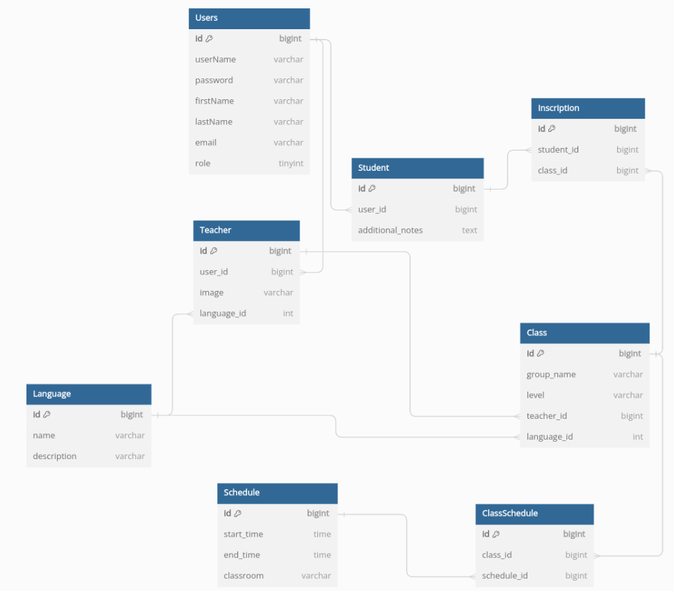

# practicaASI

## Ejecución
```bash
sudo apt update
sudo apt install openjdk-17-jdk
```

Comprobar que la versión de java openjdk es la 17

```bash
java --version
```

Instalación de mvn (comprobar que es versión 3.6.3):
```bash
sudo apt install maven
mvn --v
```

Ejecutar el backend:

```bash
cd seton/
mvn clean install
mvn spring-boot:run
```

Configuración frontend:

```bash
cd seton/frontend/
curl -o- https://raw.githubusercontent.com/nvm-sh/nvm/v0.39.5/install.sh | bash

export NVM_DIR="$HOME/.nvm"
[ -s "$NVM_DIR/nvm.sh" ] && \. "$NVM_DIR/nvm.sh"  # This loads nvm
[ -s "$NVM_DIR/bash_completion" ] && \. "$NVM_DIR/bash_completion"  # This loads nvm bash_completion

nvm install 16
sudo apt install yarn
yarn install
yarn start
```

Si el yarn install da fallo y se ha descargado la versión 0.32+git se puede actualizar usando los siguientes comandos:
```bash
curl -sS https://dl.yarnpkg.com/debian/pubkey.gpg | sudo apt-key add -
echo "deb https://dl.yarnpkg.com/debian/ stable main" | sudo tee /etc/apt/sources.list.d/yarn.list
sudo apt update && sudo apt install yarn
```

Otras dependencias que son necesarias añadir:
```bash
yarn add bootstrap
yarn add @popperjs/core
yarn add react-datepicker moment
```

## Flujo de trabajo
En el proyecto de github entra en una issue, asignate la issue y haz click en 'create branch' 
para comenzar el desarrollo de esa issue. En local:
```bash
git fetch origin
git checkout <nombre-rama>
```

Hacer el desarrollo de la funcionalidad en esa rama y al terminar mergearla con main haciendo
una pull request.

### Apuntes interesantes para el desarrollo:

- src/main/java/asi/model: localización de los ficheros para implementar el backend de la aplicación.
- frontend/src/modules/app/components: localización de los ficheros que conforman las pantallas del frontend. 
En el fichero Body.js se pueden añadir nuevas rutas.
- SecurityConfig.java: es necesario añadir las APIs en este fichero para que se puedan realizar las peticiones.

## Diagrama base de datos


- Users: administrador o profesor/estudiante.
- Teacher: profesor.
- Student: estudiante.
- Language: idioma.
- Schedule: horario.
- Class: clase.
- ClassSchedule: relación entre clase y horario.
- Inscription: relación entre clase y estudiante.
## Funcionalidades
Url para acceder a la parte de profesor/estudiante 
(una vez creada alguna cuenta en la parte de administrador): http://localhost:3000/

Url para acceder a la parte de admin: http://localhost:3000/admin

u: admin, c: admin